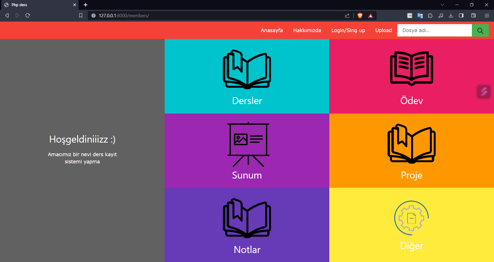

# Student Digital Portfolio Management System
A Python Django project that you can use to organize your student life and prepare for future job searches.
This project has been developed to help students manage their course grades, assignments, presentations, projects, and other relevant files and create a digital portfolio they can use in future job applications. It is a web application built with Python Django and provides database support.

# Öğrenci Dijital Portföy Yönetim Sistemi / Turkish
Öğrencilik hayatınızı düzenlemek ve gelecekteki iş arayışlarınız için kullanabileceğiniz bir Python Django projesi.
Bu proje, öğrencilerin ders notlarını, ödevlerini, sunumlarını, projelerini ve diğer ilgili dosyaları yönetmelerine ve gelecekteki iş başvurularında kullanabilecekleri bir dijital portföy oluşturmalarına yardımcı olmak amacıyla geliştirilmiştir. Python Django ile oluşturulmuş bir web uygulamasıdır ve veritabanı desteği sağlar.

## Screen Captures / Ekran Görüntüleri

* *

